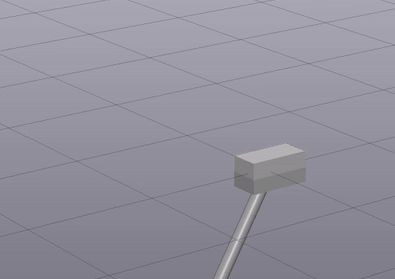

# LQR on Cart Pole

Linear Quadratic Regulator \(LQR\) is an optimal control method. Cart-Pole is a canonical model with one prismatic joint connecting the ground and cart and one revolute joint connect the cart and bar.



### A brief explanation of LQR

LQR controller is a gain matrix K, which maps income system state to control. The gain matrix K comes from the solution of Riccati Equation. 

Optimal control is all about minimizing cost. We formulate the state tracking control problem into a cost minimizing problem, which is equal to solve the Riccati Equation. What's amazing is, the solution of Riccati Equation gives us the optimal controller that generates the minimum cost.

So given the system and cost definition, we could compute the optimal controller K.

To learn more about Cart-Pole model and LQR, find the notes from [Russ Tedrake's Underactauted Robotics](http://underactuated.mit.edu/underactuated.html?chapter=acrobot).

### Get the code

Get the code from my repo, we need to modify the original SDF file to get a fully actuated Cart Pole. And we need a fixed DARE solver in Drake.

### Run the demo

```text
bazel run //examples/multibody/cart_pole:cart_pole_lqr
```

### The Code Explained


