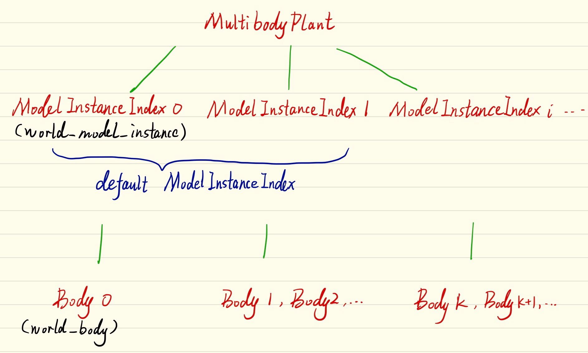

# Drake Multibody

Multibody is the highlight of Drake. It represents a robot in a tree of bodies. `MultibodyPlant` exposes APIs that compute robot mathematics including the kinematics, the dynamics, jacobian, etc. 

A good reading material to understand Multibody is [Drake's documentation of Multibody](https://drake.mit.edu/doxygen_cxx/classdrake_1_1multibody_1_1_multibody_plant.html#details). It show how `MultibodyPlant` is constructed and how it fit with other drake components.

### Robot Modeling

#### Create Multibody

To create a Multibody robot, the best way is to parse robot description file such as URDF or SDF. Drake could read URDF or SDF using a `parser`. The `parser` uses [tinyxml2](https://github.com/leethomason/tinyxml2) library to parse the XML file. It would iteratively parse each link, joint, transmission and generate a Multibody tree with the same structure described as in the XML file.

Another way to create the robot components is through `MultibodyPlant` API. For example, we could create [bodies](https://drake.mit.edu/doxygen_cxx/classdrake_1_1multibody_1_1_body.html) and connect bodies with [joints](https://drake.mit.edu/doxygen_cxx/classdrake_1_1multibody_1_1_joint.html). This normally works for simple models like inverted pendulum.

#### Be aware of some Drake features

Be careful that Drake does not support mesh file for geometry collision yet. In other words, if you need to simulate collision, you would need to create your own collision model, usually some simple geometry that wraps around your mesh file. \(I found it more convenient to add collision model using Rviz, because it has a check box allows you to show the collision geometry, way easier to visualize and compare between mesh and the simplified collision geometry.\)

If you migrate your robot from ROS, your URDF is probably using package to find the mesh file rather than using relative path. Drake support "package" concept used in ROS. However, you need to change the folder with URDF files into a `package`, which means you should provide a `package.xml` file and modify the `BUILD.bazel` file to make `bazel` recognize the `package`. In addition, in your code, the `package.xml` file path should be specified, so Drake could find the package as well. There is an example for that. \(TODO: Add example here.\)

#### Default behaviors Drake would do while parsing

One thing worth mentioning is that drake requires the model to have at least one `transmission` in the URDF, or it will fail to create input torque port for the plant. So if you do not have any `transmission` tag in the URDF, do create `SimpleTransmission` for each actuated joint.

One more thing, `MultibodyPlant` has a unique body called `world_body`. Every body created in Drake by default is a floating body, unless it is connected with some other bodies. Floating body is connected to the `world_body` with a floating joint. So if your robot should be connected to the ground, you would create new joints to connect the body and world. The floating joint will be overwritten.

#### [Mobilizer](https://drake.mit.edu/doxygen_cxx/classdrake_1_1multibody_1_1internal_1_1_mobilizer.html)

Drake uses `Mobilizer` to connect two links, it is a different concept from the traditional `Joint`.

#### Model Instance Index

`ModelInstanceIndex` is the ID of robots. The root `diagram` could have only one `MultibodyPlant`. So if you have more robots, they are grouped as `ModelInstanceIndex` within the same `MultibodyPlant`. Every element, like body, joint, etc, in the `MultibodyPlant` has a `ModelInstanceIndex`.

`ModelInstanceIndex` 0 is world. It has only one body, the world\_body, with `BodyIndex` 0.

`ModelInstanceIndex` 1 includes bodies created by Drake API with no `ModelInstanceIndex` specified.

For each robot loaded from SDF/URDF, Drake will create a unique `ModelInstanceIndex` for that robot.

### Kinematics

After the URDF file is imported, the `MultibodyPlant` is created. The plant is a class hosting a whole bunch of useful robotics function that we use to do motion planning and control.

### Jacobian

Drake support compute all kinds of jacobian. To calculate the derivative with respect to something, `AutoDiff` is used to ease the way of calculating.

### Dynamics

Drake support compute all kinds of dynamics algorithm, especially the ones in the book of [Roy Featherstone 2008](https://link.springer.com/book/10.1007/978-1-4899-7560-7).  

