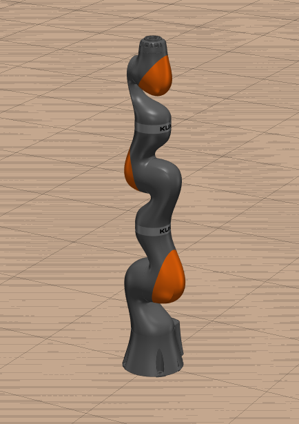

# Visualize data in LCM

System blocks communicate with opening ports. Data flow from one port to another through LCM pipelines. We could visualize the data.

Ensure that you have installed the drake visualizer with

```text
cd drake
bazel build //tools:drake_visualizer
bazel-bin/tools/drake_visualizer
```

In another terminal, we open the LCM data inspector by

```text
cd drake
bazel-bin/lcmtypes/drake-lcm-spy
```

To visualize data, we need data. Controlling a robot to move is a good way to get data flowing. We start a KUKA arm simulation. In another terminal:

```text
bazel-bin/examples/kuka_iiwa_arm/kuka_simulation
```



Then in another terminal we open up a "planner and runner".

```text
bazel-bin/examples/kuka_iiwa_arm/kuka_plan_runner
```

Finally we need to send command to the planner, it will run the KUKA arm.

```text
bazel-bin/examples/kuka_iiwa_arm/move_iiwa_ee -x 0.8 -y 0.3 -z 0.25 -yaw 1.57
```

You should see the robot arm moving with command data in the LCM inspector change simultaneously.

TODO: GIF!

### Links

The KUKA Manipulation example is [here](https://github.com/RobotLocomotion/drake/tree/master/examples/kuka_iiwa_arm).

